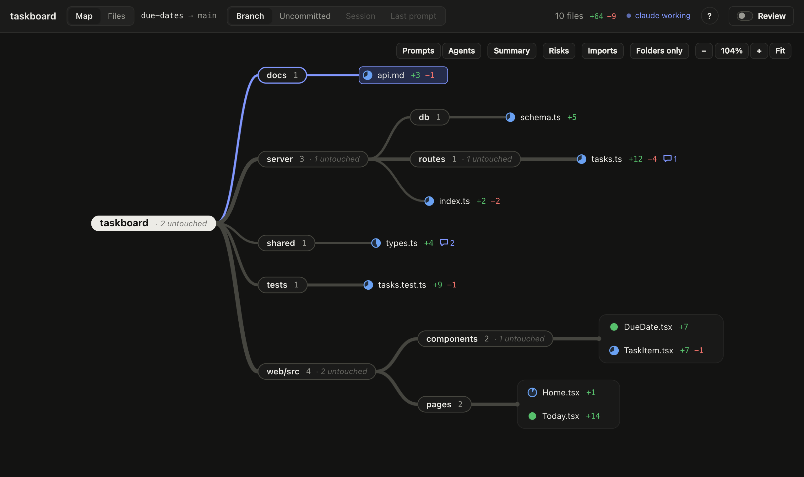
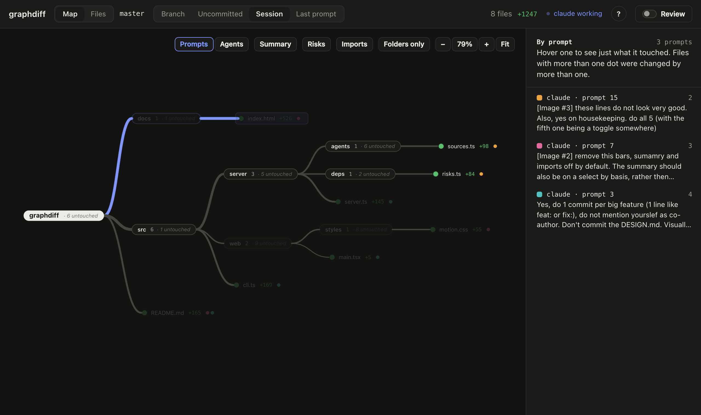
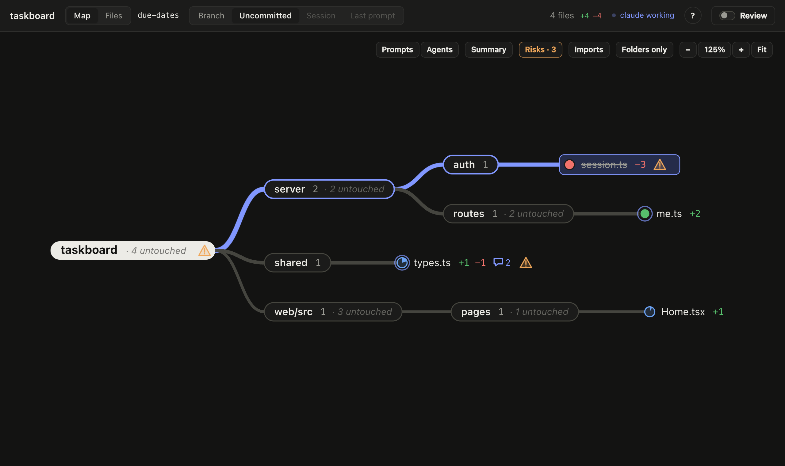
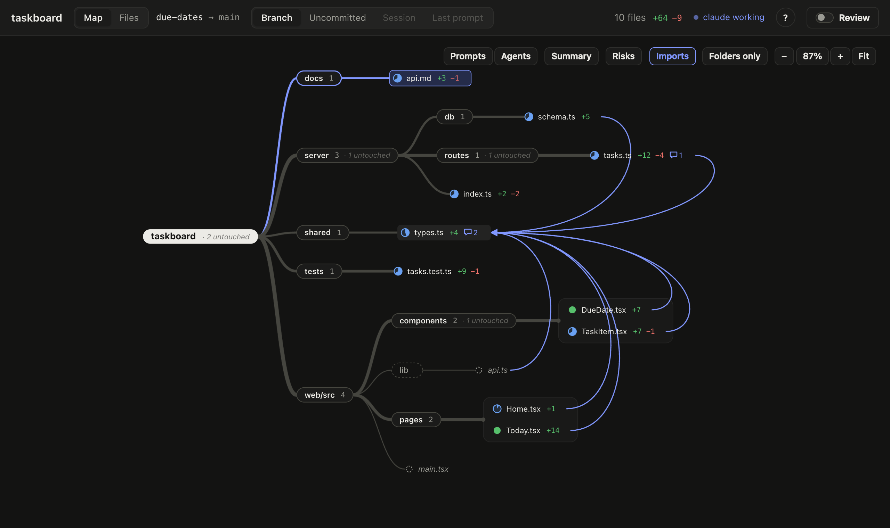
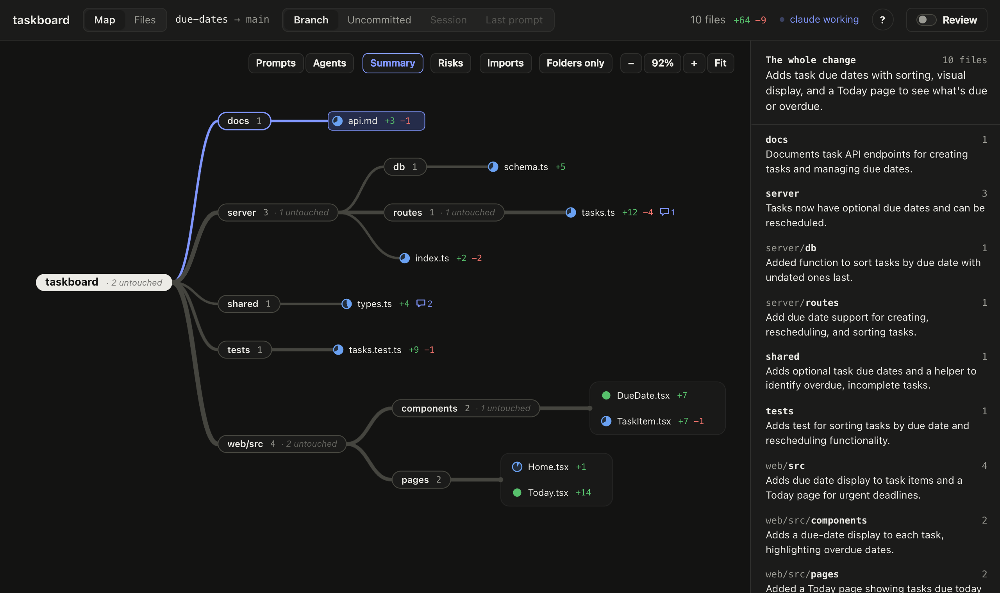
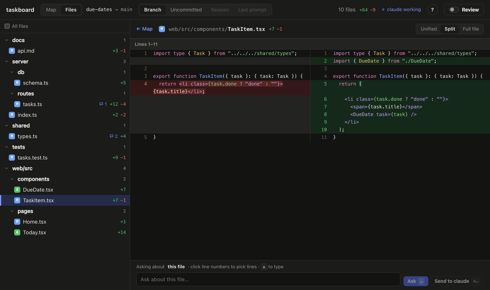
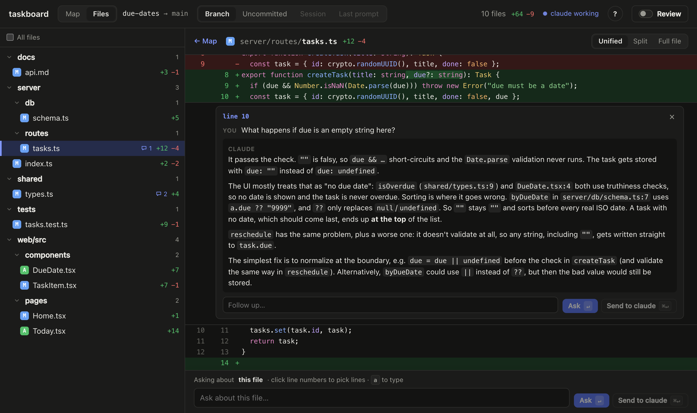
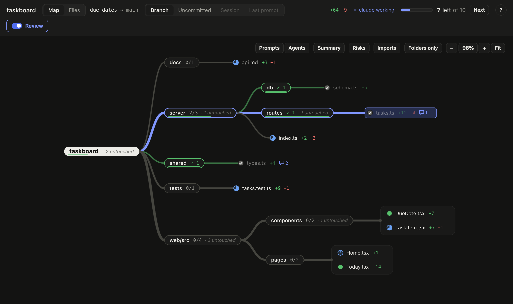

# graphdiff

**See the shape of what your coding agent changed.**

graphdiff is a [herdr](https://herdr.dev) plugin. Press `prefix+g` in a pane and your
browser opens a live map of that repo's changes: which folders were touched, how much,
and what depends on what. It's for getting a feel for a change before (or instead of)
reading every line of it.

[Website](https://zenodea.github.io/diffgraph/) · [GitHub](https://github.com/zenodea/diffgraph)



## Install

```sh
herdr plugin install zenodea/diffgraph
```

Then bind it in `~/.config/herdr/config.toml`:

```toml
[[keys.command]]
key = "prefix+g"
type = "plugin_action"
command = "graphdiff.open"
description = "graphdiff"
```

Press `prefix+g` in any pane that's inside a git repo.

## What you get

### The map

Your repo as a tree, but only the parts that changed. Each folder is a branch, and its
files sit in a small grid next to it, so even a hundred-file change stays readable.
Thicker branches changed more, so the heavy parts stand out. Each file's dot fills like a
pie with how much of that file changed, so a two-line tweak and a rewrite look different.
Each folder notes how much of it went untouched.

It's live: as the agent writes, files flash, new ones appear and the rest glide out of the
way. Pan with two fingers, pinch to zoom, press `0` to fit, and move around with
`h` `j` `k` `l`.

### What it just did

The **Last prompt** scope shows only what the agent changed for your latest prompt. And
when an agent finishes a turn, herdr shows a notification with the shape of it, like
*"claude finished · Changed 6 files: web/src 4, server/routes 2"*, so you know where to
look before you open anything.

### Who did what

**Prompts** colours each file by the prompt that changed it; **Agents** colours it by the
agent session that did, so with several agents in one repo you can see who touched what,
and where they overlap. Hover an entry in the legend to see just its files.



### Risks

Turn on **Risks** to flag things worth a second look: files that were mostly rewritten,
very large changes, a deleted file or a removed export that something still imports, and
code that changed with no tests touched.



### Imports

Turn on **Imports** and hover a file to see what it imports and which files use it.
Unchanged files that depend on the change show up faded, so you can see how far it
could reach. Works for TypeScript/JavaScript, Python and Go.



### What changed, in words

Turn on **Summary** and pick a folder (or the whole change) to get one plain sentence
about it. Summaries are written by a small model when you ask for them, and cached
until that folder changes.



### The diff, when you want it

Click a file to read it: unified, side by side, or the whole file with removed lines
folded away. Syntax colours and word-level highlights included. If the agent's session
transcript is around (Claude Code, Codex or pi), a "why" panel shows the prompt that led
to the change.



### Ask about it

Click line numbers (shift-click for a range) and ask. Enter asks a read-only side agent
(the same kind as the one in your pane: Claude Code, Codex or pi) and the answer appears
right under those lines. `⌘Enter` sends the question to the agent
in your herdr pane instead.



### Review mode

By default graphdiff is just for looking. Switch on **Review** (`r`) when you want to
work through a change: a count of what's left, ticks on files and folders, and
`space` to mark a file reviewed and jump to the next. If the agent edits a file you've
already reviewed, it's flagged as "edited again".



## Keys

| key | |
| --- | --- |
| `g` | map ⇄ files |
| `j` `k` · `Enter` | select · open |
| `h` `l` | on the map: fold the folder you're in · unfold the one you're on |
| `+` `−` `0` | zoom in, out, fit |
| `1` `2` `3` | unified, split, full file |
| `a` | ask about the selection |
| `r` | review mode (then `space` marks reviewed, `n` jumps to the next) |
| `?` | what everything means |

## Scopes

- **Branch:** everything since the branch left `main` (or `master`), plus uncommitted work.
- **Uncommitted:** only what isn't committed yet.
- **Session:** only what the agent in this pane touched since its session started.
- **Last prompt:** only what it touched for your latest prompt.

Session and Last prompt read the agent's own transcript (Claude Code, Codex or pi), so they
only see edits it made with its edit tools, not ones it made through shell commands.

## Config

Optional, in `$(herdr plugin config-dir graphdiff)/config.json`:

```json
{
  "port": 4777,
  "base": "main",
  "ask": { "command": ["my-agent", "--read-only"], "format": "text" },
  "summary": { "enabled": true },
  "notify": true
}
```

- `base`: the branch to compare against (detected when left out).
- `ask.command`: what answers questions. Leave it out and graphdiff uses the same kind of
  agent as the one in your herdr pane, run headless, read-only and without saving a
  session: `claude -p` (Haiku for summaries), `codex exec` in a read-only sandbox, or
  `pi -p` with read-only tools. If the pane's agent isn't one of those, it falls back to
  whichever is installed. A custom command gets the prompt on stdin, runs in the repo, and
  its stdout is the answer.
- `summary`: switch summaries off with `"enabled": false`, or set `command` the same way.
- `notify`: `false` turns off the herdr notification when an agent finishes.

## How it works

`graphdiff.open` starts a small local server once and opens
`http://127.0.0.1:4777/r/<repo>?t=<token>`. The server only listens on loopback, every
request needs the token, and it exits after 30 idle minutes. It reads your repo with
`git`, watches it for changes, and keeps review marks and question threads in herdr's
plugin state directory. Nothing leaves your machine except the prompts you choose to
send to a model (questions and summaries).

On macOS, `prefix+g` brings an already-open graphdiff tab to the front in Chrome, Brave,
Edge or Safari (Firefox can't be asked about its tabs, so there it opens a new one).

`herdr plugin action invoke graphdiff.stop` stops the server.

## Development

```sh
npm install
npm run dev        # rebuild the page on change
npm run serve      # run the server in the foreground
npm run typecheck
npm test
herdr plugin link "$PWD"
```

```
src/
  cli.ts            open / serve / stop / notify
  server/
    core/           HTTP, live events, config, herdr
    git/            scopes, changed files, diffs
    review/         review marks
    agents/         transcripts, "why", questions, summaries, who did what
    deps/           import graph, risk hints
    notify.ts       the "agent finished" notification
  web/
    app/            page shell and top bar
    map/            the map, layout, pan and zoom
    files/          file list, file pane, "why"
    diff/           diff views, highlighting
    ask/            questions and answers
    styles/         one stylesheet per area
docs/               landing page and screenshots
```
